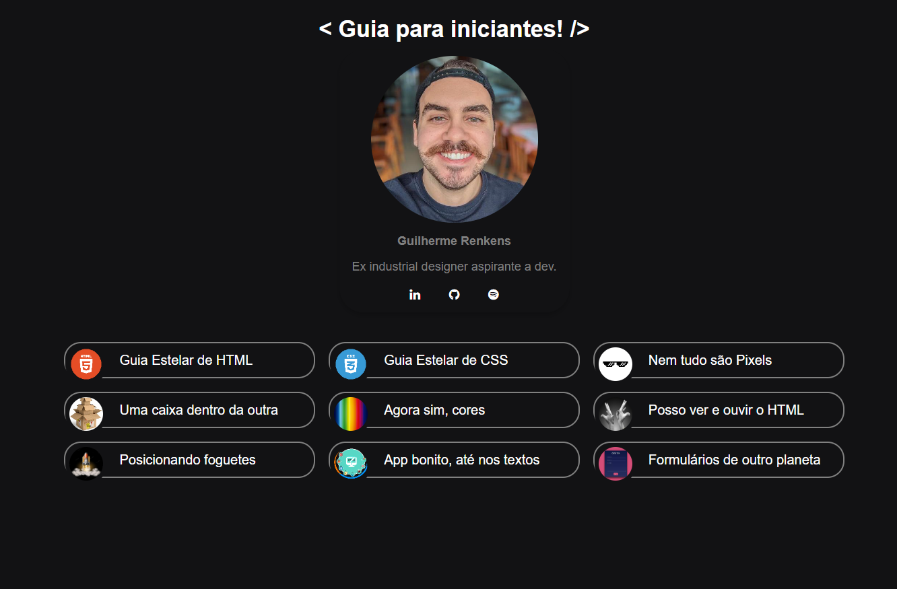

# Sumário

> Trilha Fundamentar

Trilha para aprender os fundamentos da programação web.

[🔗 Clique aqui para acessar](https://renkensg.github.io/sumario-discover/)

## 🔸 Tópicos abordados

- [Guia Estelar HTML](https://renkensg.github.io/sumario-discover/01-html.html)
- [Guia Estelar CSS](https://renkensg.github.io/sumario-discover/02-css.html)
- [Nem tudo são Pixels](https://renkensg.github.io/sumario-discover/03-pixels.html)
- [Uma caixa dentro da outra](https://renkensg.github.io/sumario-discover/04-caixa.html)
- [Agora sim, cores](https://renkensg.github.io/sumario-discover/05-cores.html)
- [Posso ver e ouvir o HTML](https://renkensg.github.io/sumario-discover/06-verouvir.html)
- [Posicionando foguetes](https://renkensg.github.io/sumario-discover/07-foguetes.html)
- [App bonito, até nos textos](https://renkensg.github.io/sumario-discover/08-texto.html)
- [Formulários de outro planeta](https://renkensg.github.io/sumario-discover/09-formularios.html)

## 📩 Contato

renkensg@gmail.com
